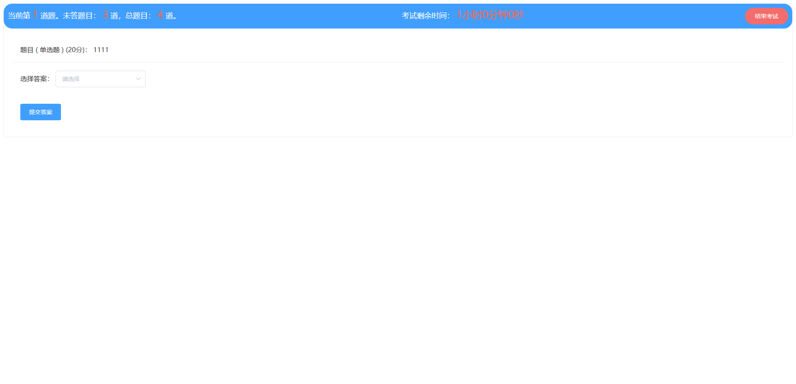

# 1 项目介绍
基于SpringBoot+Vue的线上教学平台：后端 SpringBoot、Mybatis-Plus，前端Vue+ElementUI，具体功能如下：
## 管理端
- 学员管理
- 资料类型管理
- 学习资料管理
- 交流论坛
- 我的收藏管理
- 试卷管理
- 试题管理
- 留言板管理
- 考试管理
- 系统管理：包括轮播图管理和公告管理
- 个人中心：查看和修改个人信息
## 用户端
- 我的收藏管理
- 留言板管理
- 考试管理：查看考试记录和错题本
- 个人中心：查看和修改个人信息
## 前台
- 首页：展示公告信息和学习资料
- 学习资料：查看学习资料列表、资料详情、收藏资料、评论资料
- 交流论坛：查看论坛列表、论坛详情、论坛评论
- 试卷列表：查看试卷信息、参加考试
- 公告信息：查看公告列表、公告详情
- 留言反馈
- 个人中心：查看和修改个人信息
# 2 系统运行截图
## 2.1 用户登录

## 2.2 学员管理

## 2.3 资料类型管理

## 2.4 学习资料管理

### 2.4.1 预览视频

### 2.4.2 查看评论

### 2.4.3 编辑资料

## 2.5 交流论坛管理

## 2.6 我的收藏管理

## 2.7 试卷管理

## 2.8 试题管理

### 2.8.1 修改试题

## 2.9 留言板管理

### 2.9.1 留言详情

### 2.9.2 留言回复

## 2.10 系统管理
### 2.10.1 轮播图管理

### 2.10.2 公告管理

## 2.11 考试管理
### 2.11.1 错题本

### 2.11.2 试卷列表

### 2.11.3 考试记录

### 2.11.4 考试详情

## 2.12 前台页面
### 2.12.1 首页面

### 2.12.2 学习资料

### 2.12.3 资料详情

### 2.12.4 交流论坛

### 2.12.5 发布帖子

### 2.12.6 帖子详情

### 2.12.7 试卷列表

### 2.12.8 在线考试

### 2.12.9 公告信息

### 2.12.10 公告详情

### 2.12.11 留言反馈

### 2.12.12 个人中心

# 3 项目文档
## 3.1 数据库设计

## 3.2 万字文档

## 3.3 PPT

# 4 其他
V：mengweiyang12
